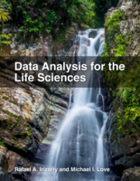

## Stat Learning Book Club

The Stat Learning Book Club brings students, researchers, and scholars together to learn, discuss and present topics related to data analysis, statistics and the R language.

**Data Analysis for the Life Sciences** by *Rafael A. Irizarry* and *Michael I. Love*

Download the textbook here:

[ePub from LeanPub](https://leanpub.com/dataanalysisforthelifesciences/){:target="_blank"}
[Textbook website](http://genomicsclass.github.io/book/){:target="_blank"}

Please send us an email to **join** our Google Group. <a href="mailto:Stat_learning@googlegroups.com"><i class="fa fa-envelope" aria-hidden="true"></i></a>

Days: Every **Tuesday at 11 AM EST** (subject to change)

Where:

Online:
[Google Hangouts](https://www.tinyurl.com/predictionhangout){:target="_blank"}
or
[Adobe Connect](https://huntercollege.adobeconnect.com/bookclub){:target="_blank"} (when participants > 10)

In person: CUNY Graduate School of Public Health and Health Policy

**Additional Information**

* [GoogleSheets Schedule](http://tinyurl.com/huw8cb5){:target="_blank"}
* [Google Email Group](https://groups.google.com/d/forum/stat_learning){:target="_blank"}

